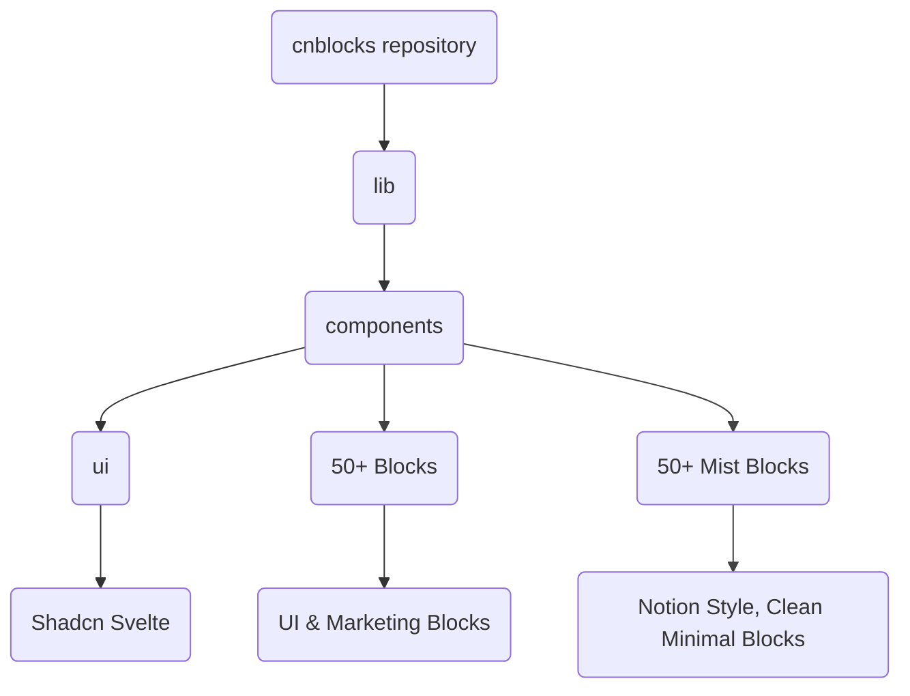

# Svelte Shadcn Blocks

A collection of beautifully designed, ready-to-use UI blocks for Svelte 5, built with Tailwind CSS v4 and shadcn-svelte.

## Overview

Visit to Preview the blocks: [Svelte Shadcn Blocks](https://sv-blocks.vercel.app/)
Svelte Shadcn Blocks consists of 2 main variants:

1. **Normal** - A vibrant, bold design with a focus on marketing and UI components.
2. **Mist** - A clean, minimal design inspired by Notion, perfect for documentation and content-heavy applications.

Each variant include **50+ blocks** that can be used in your projects.
These blocks are designed to be easily customizable and integrate seamlessly with your Svelte applications.

You can use these blocks to build landing pages, marketing sites, dashboards, and more.

## Features

- **100+ Ready-to-use UI & Marketing Blocks**
- **Free & Open Source** - Licensed under MIT
- **Fully Responsive** – Works seamlessly across all screen sizes
- **Light & Dark Mode Support**
- **Easy to Customize** – Modify styles and components effortlessly
- **CLI Support** – jsrepo CLI for easy installation and updates

## Documentation

LLM-friendly documentation is in `/static/docs`, with `normal/` for bold, vibrant blocks and `/static/docs/mist` for clean, Notion-inspired blocks. Each file provides usage examples and Tailwind styles for AI code generation.

Docs for Mist Variant : [Visit](/static/docs/mist)

Docs for Normal Variant : [Visit](/static/docs/normal)

Docs for MCP Server Integration : [Visit](https://sv-blocks.vercel.app/docs/mcp)

## Installation & Usage

Visit the [installation guide](https://sv-blocks.vercel.app/docs/installation) for detailed instructions on how to set up and use Svelte Shadcn Blocks in your project.

## Inspiration

This project is inspired from [Tailark](https://tailark.com/).
The goal is to provide a similar experience for Svelte developers.

## Sponsor

If you like this project, please consider supporting me on [GitHub Sponsors](https://github.com/sponsors/SikandarJODD).

## Contributing
Contributions are welcome! 💛
If you have ideas for new blocks, improvements, or bug fixes, please feel free to open an issue or submit a pull request.

If you have any feedback, please reach out to me on [Twitter](https://x.com/Sikandar_Bhide) or create an issue on GitHub.

## Project Structure
if you want to add new blocks follow the structure below:

## License

Published under the [MIT](https://github.com/SikandarJODD/cnblocks/blob/master/LICENSE) license.
Built by [@Sikandar Bhide](https://github.com/SikandarJODD), [@Aidan Bleser](https://github.com/ieedan) 💛
  

