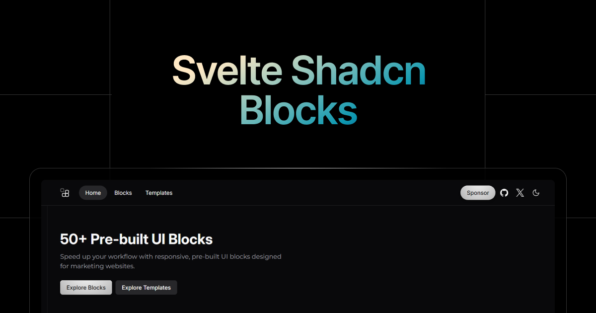

# Svelte Shadcn Blocks

A collection of beautifully designed, ready-to-use UI blocks for Svelte 5, built with Tailwind CSS v4 and shadcn-svelte.

## New Components

| Name                   | Preview                                                       |
| ---------------------- | ------------------------------------------------------------- |
| 4 New Hero Sections    | [Preview](https://sv-blocks.vercel.app/hero#feature-eight)    |
| 7 New Features Blocks  | [Preview](https://sv-blocks.vercel.app/feature#feature-eight) |
| 3 New Faq Blocks       | [Preview](https://sv-blocks.vercel.app/faq)                   |
| Forgot Password Blocks | [Preview](https://sv-blocks.vercel.app/forgot-password)       |

## Features

- **50+ Ready-to-use UI & Marketing Blocks**
- **Fully Responsive** – Works seamlessly across all screen sizes
- **Light & Dark Mode Support**
- **Built with Modern Technologies** – Svelte 5, Tailwind v4, and shadcn-svelte
- **Easy to Customize** – Modify styles and components effortlessly
- **Optimized for Performance** – Fast loading and minimal footprint

## Sponsor

If you like this project, please consider supporting me on [GitHub Sponsors](https://github.com/sponsors/SikandarJODD).

## Feedback

If you have any feedback, please reach out to me on [Twitter](https://x.com/Sikandar_Bhide) or create an issue on GitHub.

## License

Published under the [MIT](https://github.com/SikandarJODD/cnblocks/blob/master/LICENSE) license.
Built by [@Sikandar Bhide](https://github.com/SikandarJODD), [@Aidan Bleser](https://github.com/ieedan) 💛
  

